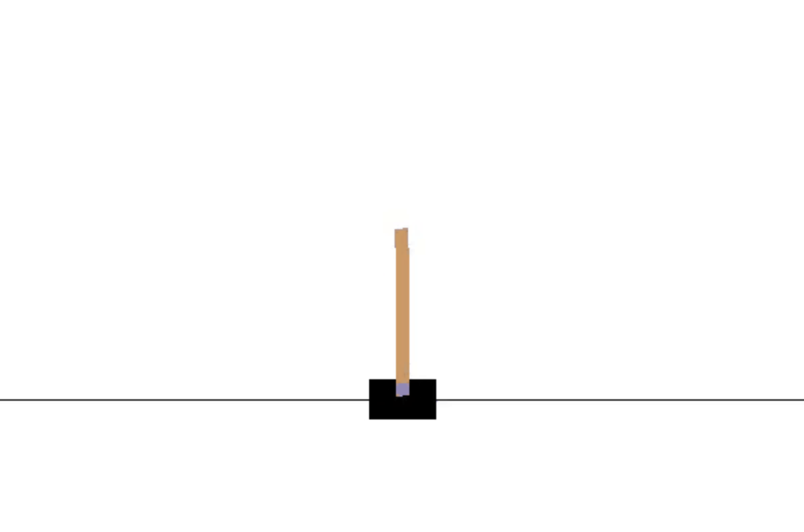
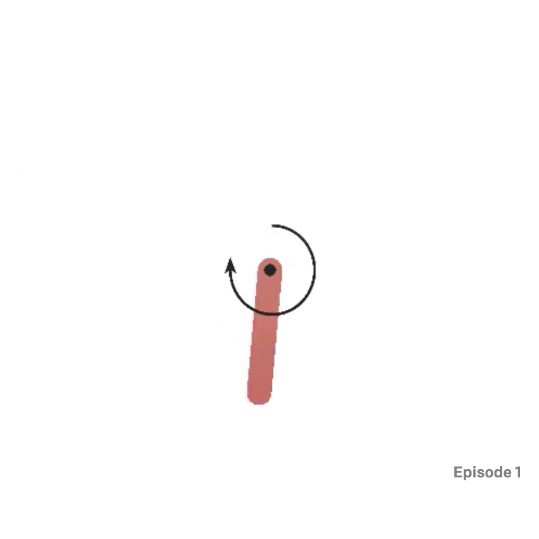
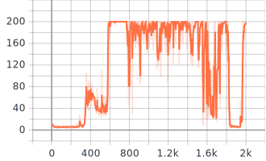
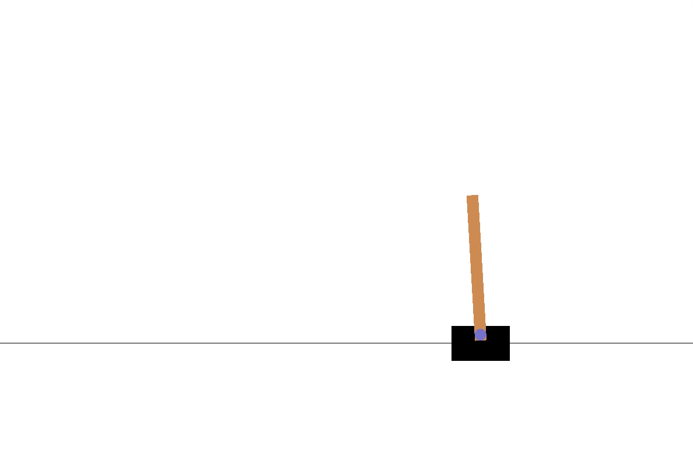
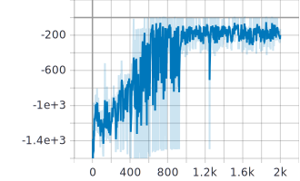

# pytorch-DDPG
pytorch implementation of DDPG, a continous space algorithm

## DDPG
DDPG takes the struture similar to actor-critic, where a policy network is optimized to maximize the output of a value network and value network interacting with the environment tries to find the true expected value of any given state. There is four networks in DDPG, two updating networks, target and value network and two target networks which are copies of the policy and value network. In optimization, value network use an approach similar to DQN(see https://github.com/williamium3000/pytorch-DQN for more details and implementation) while policy network use an approach similar to PG, where the network updates torwards the direction where value function geive highest value. In other words, policy network updates under the supervision of value network.

## Implementation

- agent.py: agent interacting with environments and performing DDPG
- env.py: code from paddle, modify CartPole into a continuous space problem
- experience_replay.py: experience replay in DQN
- train.py: training entrance
- network.py: value and policy network in pytorch
To start training, modify the environment and hyperparameters in the train.py as you want and starts training

    python train.py

We records the reward each episode in tensorboard, feel free to check

    tensorboard --logdir=runs 
## Experiments and results

### Environment

#### CartPole-v0
Traditional CartPole-v0 involves a pole on a car and an agent is required to hold control of the car(left/right) in order to prevent the pole from falling. Each step, the agent is rewarded 1 if the pole fails to fall, with a maximum steps of 200. In our experiment, since DDPG works on continuous space, we turn the traditional one into continuous one via paddle open source code.

#### Pendulum-v0
Pendulum-v0 involves a pendulum starting in a random position, and the goal is to swing it up so it stays upright.

### Results
Both agents are traind for 2000 episodes using a learning rate of 0.001, BATCH_SIZE of 32, learning frequency of 5 steps and gamma of 0.95.
It is worth mentioning that since policy network gives out a direct continuous value(an action given states), we need to add some noise to push the agents into exploring. We use a Gaussian noise with mean of 0.01 and std of 1.
#### CartPole-v0
We plot the reward of each episode

A demo of trained agent is followed

#### Pendulum-v0
We plot the reward of each episode

A demo of trained agent is followed
